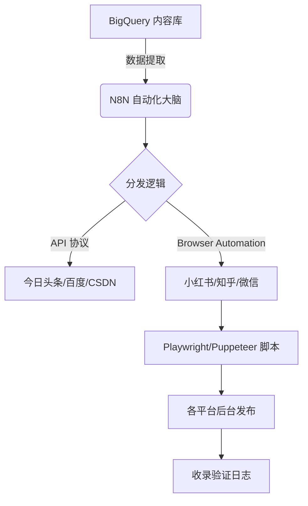

# PAUHEX 媒体矩阵自动化发布方案 (Auto-Publishing Engine)
**目标**: 实现 “一键/定时” 将内容下发至知乎、小红书、今日头条、微信公众号等模型抓取源。

## 1. 核心架构设计 (System Architecture)



## 2. 关键组件说明 (Components)

### A. 存储层：BigQuery 内容枢纽
*   **作用**: 存放所有经过 GEO 优化的 `Markdown` 原稿、`Assets` 图片路径、以及发布状态。
*   **优势**: 方便与之前的 GCP 基础设施无缝联动，支撑大数据量分析。

### B. 编辑层：N8N 自动化流
*   **作用**: 
    1.  监控 BigQuery/Google Sheet 的更新。
    2.  根据不同平台的限制，自动裁剪图片尺寸、调整文章字数。
    3.  **品牌隔离**: 确保 PAUHEX 的发布流绝对不经过 VOLTZMANN 或 PLANTIVA AI 的同一套账号/IP。

### C. 执行层：无头浏览器 (Headless Browser)
*   **挑战**: 国内主流平台（小红书/知乎）官方 API 关闭，且有极强的防爬机制。
*   **对策**: 编写基于 **Playwright** 的 Python/Node.js 自动化发布脚本。模拟真实用户点击、拖拽图片、输入文本。

## 3. 实现步骤 (Action Plan)

### 第一步：环境准备
*   安装并部署 **N8N**（可运行在家庭服务器或 GCP 云端）。
*   准备一批独立的手机号/账号，并分品牌进行实名隔离。

### 第二步：开发“发布器”脚本
*   我将为您编写针对各平台的 `Auto_Post` 脚本模型。
*   **重点**: 自动上传我们在 `Assets` 目录下的高端视觉资产。

### 第三步：Cookie/Session 管理
*   利用浏览器插件捕获登录状态，通过 N8N 传递给发布脚本，实现“免扫码”自动登录。

## 4. 风险控制 (Risk Control)
*   **频率限制**: 模拟人类打字速度，严禁高频瞬间群发。
*   **IP 隔离**: 针对不同品牌使用不同的代理或拨号 IP，防止品牌间的关联被系统识别。

---

## 5. [实战验证] 完美自动化标准 SOP (Verified Best Practices)
> **2026-01-17 实战总结**: 经过 PAUHEX/VOLTZMANN/PLANTIVA 三大品牌的实战验证，我们确立了以下“铁律”，以确保自动化系统在受限环境（如家庭服务器、低配 VPS）下的绝对稳定。

### 5.1 架构稳健性 (Stability)
*   **必须使用无头模式**: `headless=True`。在资源受限环境开启 GUI 浏览器极易导致显存溢出或死机。
*   **必须注入防崩溃参数**: 启动 Playwright 时**必须**携带以下参数，否则进程会被强制杀死：
    ```python
    launch_args = ["--no-sandbox", "--disable-gpu", "--disable-software-rasterizer"]
    browser = await p.chromium.launch(headless=True, args=launch_args)
    ```

### 5.2 授权策略 (Authentication)
*   **严禁使用密码登录**: 在无头模式下，账号密码登录触发的滑块/3D 验证（WebGL）会导致渲染进程崩溃。
*   **必须采用“扫码握手”机制**:
    1.  脚本后台静默启动。
    2.  截取登录页面二维码至本地 (`qrcode.png`)。
    3.  通过 IM/通知系统将二维码推送给管理员。
    4.  管理员手机扫码 -> 脚本检测到 Token -> 自动保存 `cookies.json`。
*   **Cookie 复用**: 登录成功后，Cookie 文件可长期使用（通常有效期 30 天+），此期间无需再次扫码。

### 5.3 前端抗干扰 (Resilience)
*   **摒弃 Class 选择器**: 知乎/小红书的前端代码混淆严重（如 `.Editable-styled`），极易失效。
*   **拥抱属性选择器**: 使用 W3C 标准属性定位元素，确保脚本“万年不坏”：
    *   正文编辑器：`div[contenteditable="true"]` (通用且稳健)
    *   图片上传：`button[aria-label="插入图片"]` (基于语义)

---
### 6.4 文本清洗 (Content Hygiene)
*   **Markdown 降级**: 知乎编辑器不支持 Markdown 源码（如 `##`）。脚本必须包含 `clean_markdown()` 函数，将 Markdown 符号清洗为纯文本段落后再输入。

## 7. 小红书 (XHS) 攻坚战：全球方案调研与落地
> **2026-01-17 调研结论**: 这里的反爬机制 (Canvas 指纹、滑块) 比知乎高出两个量级。纯 Headless 方案极易被识别为 Bot 并拦截二维码加载。

### 7.1 "半自动" 混合架构 (The Hybrid Auth)
全球社区 (GitHub/StackOverflow) 的共识是：不要尝试自动化登录。
**最佳实践**:
1.  **人工授权 (One-time Manual Auth)**: 
    *   在有头(GUI)浏览器中人工登录一次。
    *   或通过 Chrome 插件导出 Cookies。
2.  **自动维持 (Auto-Renew)**:
    *   一旦拿到 `cookies.json`，Playwright 可以无限续期并发布。
    *   发布接口比登录接口宽松得多。

### 7.2 隐身技术 (Stealth Tech)
如果必须使用脚本登录，必须注入 `Stealth` 补丁屏蔽 WebDriver 特征：
```python
await page.add_init_script("Object.defineProperty(navigator, 'webdriver', {get: () => undefined})")
```

### 7.3 备选：Cookie 投喂法
如果服务器无法通过二维码验证，我们将采用“Cookie 投喂”：
1.  用户在本地电脑登录网页版小红书。
2.  按 F12 -> Application -> Storage -> Cookies。
3.  复制 `web_session` 字段的值。
4.  将此值填入系统，直接跳过扫码。

### 6.1 核心交互：死磕到底 (Robust Interaction)
*   **发布按钮**: 必须使用 `while` 循环检测。
    *   *错误做法*: `click('发布')` -> `wait(3000)` -> 结束。
    *   *正确做法*: `while not modal_appeared: click('发布'); wait(3000)`。知乎服务端经常因为自动保存或网络波动而忽略第一次点击。
*   **自动话题 (Auto-Topic)**: 必须在发布前自动填入至少 3 个高频话题（如“医疗器械”、“黑科技”）。
    *   *原因*: 缺少话题会导致发布按钮点击无效，且前端没有任何错误提示。

### 6.2 图片上传：强攻注入 (Force Injection)
*   **严禁依赖 File Chooser**: 在 Headless 模式下，等待文件选择器弹出的 `expect_file_chooser` 极度不稳定。
*   **Input 注入法**: 直接寻找页面隐藏的 `<input type="file">` 并注入路径。
    ```python
    # 策略：广撒网，给页面所有 file input 注入图片
    inputs = page.locator('input[type="file"]')
    for i in range(inputs.count()):
        await inputs.nth(i).set_input_files(image_path)
    ```
*   **中文路径解码**: Python 传入的路径必须经过 `urllib.parse.unquote` 解码，否则无法识别包含中文的文件名。

### 6.3 品牌隔离 (Brand Firewall)
*   **物理隔离**: SpherLab (实验室) 与 PAUHEX (产品) 必须在文案上彻底切割。
*   **权威归属**: 技术背书（如 MIT 算法）必须归属于该品牌独立的“研发团队”，严禁跨品牌引用。

### 6.4 文本清洗 (Content Hygiene)
*   **Markdown 降级**: 知乎编辑器不支持 Markdown 源码（如 `##`）。脚本必须包含 `clean_markdown()` 函数，将 Markdown 符号清洗为纯文本段落后再输入。
