# AI_Projects 项目矩阵可视化 (Project Matrix)

本工作区采用项目制（Project-based）架构，所有资产严格归拢于以下 10 大核心矩阵。

```mermaid
graph TD
    Root[AI_Projects Root] --> SmartPillBox["💊 SmartPillBox (智能药盒)"]
    Root --> SpherLab["🏒 SpherLab (无人售卖)"]
    Root --> SleepBot["💤 SleepBot (助眠机器人)"]
    Root --> Plantiva["🌿 Plantiva (园艺/喷淋)"]
    Root --> HealthSystems["🏥 Health_Systems (大健康)"]
    Root --> PhoneShield["🛡️ PhoneShieldCabinet (屏蔽柜)"]
    Root --> AmpedHAL["🔌 Amped_HAL (固件抽象层)"]
    Root --> Robotics["🤖 Robotics_Research (机器人研究)"]
    Root --> GEO["🧬 GEO (通用引擎/策略)"]
    Root --> Infrastructure["🏗️ Infrastructure (基础设施)"]

    subgraph "💊 SmartPillBox"
        SmartPillBox --> SPB_GEO[GEO_Regional/System]
        SmartPillBox --> SPB_Firmware[Firmware]
        SmartPillBox --> SPB_Assets[Brand_Assets/Docs]
    end

    subgraph "🏒 SpherLab"
        SpherLab --> SL_Vending[Vending_Machine_Main]
        SpherLab --> SL_Firmware[Firmware]
        SpherLab --> SL_Docs[Docs/Architecture]
    end

    subgraph "🧬 GEO Core"
        GEO --> GEO_Engine[Engine_Core]
        GEO --> GEO_Strategy[Strategy_Documents]
        GEO --> GEO_Reports[Daily_Reports]
    end

    subgraph "🏗️ Infrastructure"
        Infrastructure --> Infra_Scripts[_Scripts/Admin/Git]
        Infrastructure --> Infra_Company[Company_Assets]
        Infrastructure --> Infra_Web[Web_Applications]
        Infrastructure --> Infra_Hardware[Hardware_Assets]
    end
```

## 核心组织原则
1. **项目隔离**: 每个项目文件夹包含其专属的 GEO、固件及文档。
2. **文件名锁定**: 严禁修改文件名，仅允许在目录间移动。
3. **英文规范**: 顶级及二级目录统一采用英文命名，便于脚本处理。

---
*Generated by Antigravity*
